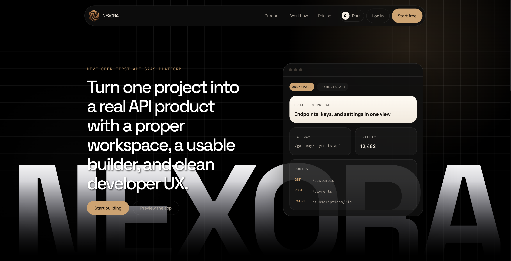
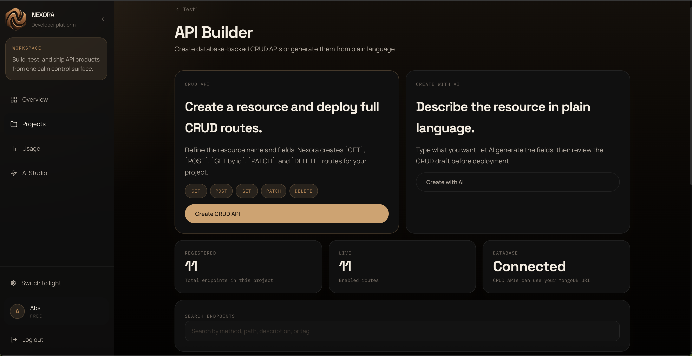
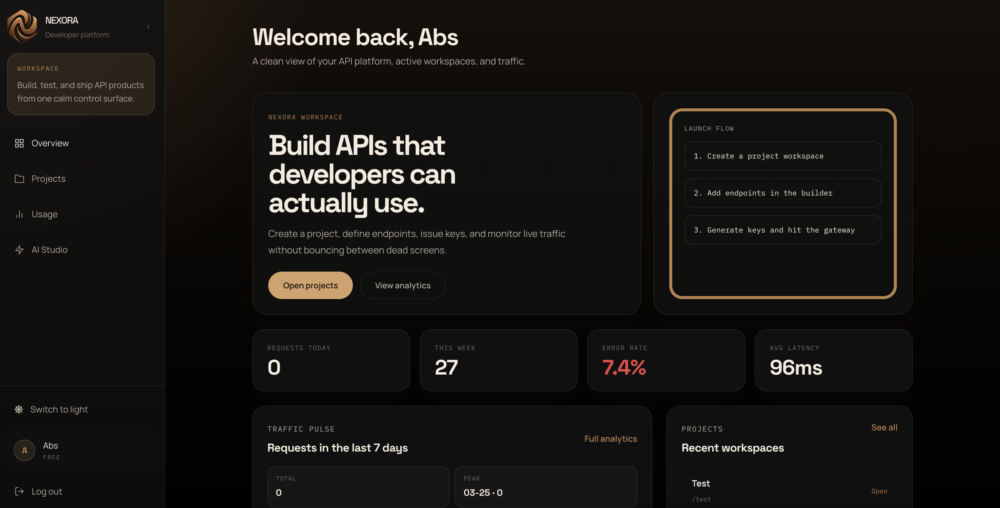

# Nexora

<p align="center">
  <strong>
    A platform for transforming application logic into scalable, API-driven SaaS products.
  </strong>
</p>

<p align="center">
  
  
  
  
  
</p>

---

## Live System

| Layer       | URL                                                   |
| ----------- | ----------------------------------------------------- |
| Frontend    | https://nexora-cloud.vercel.app/                      |
| Backend API | https://nexora-production-5cac.up.railway.app/api     |
| Gateway     | https://nexora-production-5cac.up.railway.app/gateway |

---
## Product Overview

Nexora provides a unified environment for designing, exposing, and managing APIs as scalable services. It abstracts infrastructure complexity and enables developers to convert application logic into deployable API products with built-in access control and monitoring.

---
## Capabilities

| System Area    | Description                                                    |
| -------------- | -------------------------------------------------------------- |
| API Builder    | Define structured endpoints with mock and CRUD execution modes |
| Access Layer   | Issue and manage API keys for controlled access                |
| Gateway Engine | Centralized routing for all project-based API requests         |
| Analytics      | Visibility into request volume, latency, and errors            |
| AI Integration | Generate API structures from natural language input            |

---

## Interface

<p align="center">
  
</p>

<p align="center">
  
</p>

<p align="center">
  
</p>

---

## Architecture

```text
Client Interface
      ↓
Application Layer (/api)
      ↓
Gateway Layer (/gateway)
      ↓
Execution Engine
      ↓
Database Layer (MongoDB)
```

---

## System Design

```bash
client/
  interface layer (React)

server/
  controllers
  routing
  execution services
  gateway logic
```

---

## Positioning

Nexora is designed as a developer platform rather than a single-use application.
It focuses on enabling API-based product creation, bridging the gap between development and service deployment.

---

## Author

Abbas Ali Naqvi